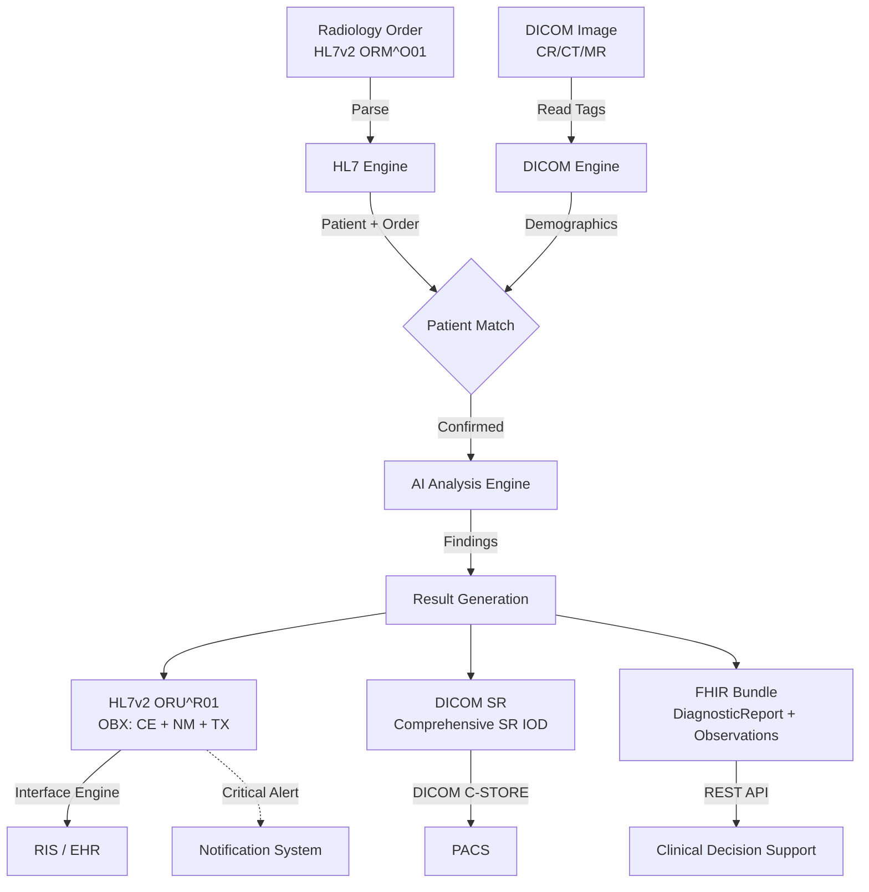

# Integration Architecture

## Radiology AI Result Delivery

This document describes the integration architecture for delivering AI radiology findings through hospital infrastructure.

## Data Flow



## Standards in Use

### HL7v2 (Traditional Messaging)

| Message | Use Case | Key Segments |
|---------|----------|--------------|
| ORM^O01 | Radiology order from EHR | MSH, PID, ORC, OBR |
| ORU^R01 | AI results to RIS/EHR | MSH, PID, ORC, OBR, OBX |
| ADT^A08 | Patient update | MSH, EVN, PID, PV1 |
| ACK | Message acknowledgment | MSH, MSA |

### DICOM (Imaging)

| Object | SOP Class UID | Use Case |
|--------|--------------|----------|
| CR Image | 1.2.840.10008.5.1.4.1.1.1 | Chest X-ray source image |
| CT Image | 1.2.840.10008.5.1.4.1.1.2 | CT source images |
| Comprehensive SR | 1.2.840.10008.5.1.4.1.1.88.33 | AI findings as structured report |

### FHIR R4 (Modern APIs)

| Resource | Maps From | Purpose |
|----------|-----------|---------|
| Patient | PID segment / DICOM patient tags | Patient identity |
| ServiceRequest | ORC/OBR segments | Radiology order |
| ImagingStudy | DICOM study metadata | Study reference |
| Observation | OBX segments (AI findings) | Individual AI finding with confidence |
| DiagnosticReport | ORU^R01 message | Complete AI analysis report |
| Bundle | Full ORU message | Atomic transaction for all resources |

## AI Finding Encoding

The same AI finding (e.g., "Infectious pneumonia, confidence 0.92") is encoded differently in each standard:

### HL7v2 OBX Encoding
```
OBX|2|CE|59776-5^PROCEDURE FINDINGS^LN|AI-1|128601007^Infectious pneumonia^SCT||||||F
OBX|3|NM|59776-5^PROCEDURE FINDINGS^LN|AI-1-CONF|0.92||||||F
```

### DICOM SR Content Tree
```
CONTAINER: Finding
  ├── CODE: Clinical finding = 128601007 (Infectious pneumonia) [SCT]
  ├── NUM: Degree of certainty = 0.9200 [%]
  └── CODE: Finding site = 266005 (Right lower lobe of lung) [SCT]
```

### FHIR Observation
```json
{
  "resourceType": "Observation",
  "code": {
    "coding": [{"system": "http://snomed.info/sct", "code": "128601007", "display": "Infectious pneumonia"}]
  },
  "component": [{
    "code": {"coding": [{"system": "http://snomed.info/sct", "code": "397003", "display": "Degree of certainty"}]},
    "valueQuantity": {"value": 0.92, "unit": "probability"}
  }]
}
```
